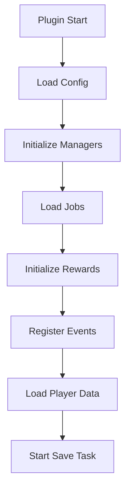
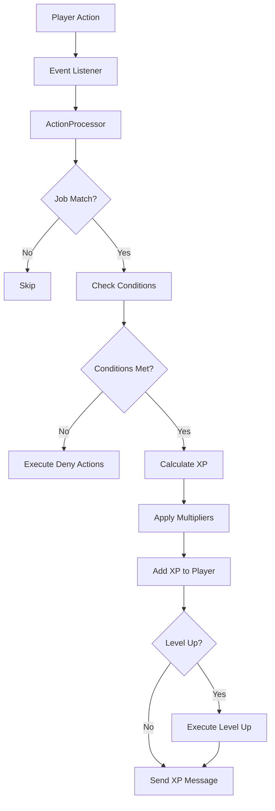
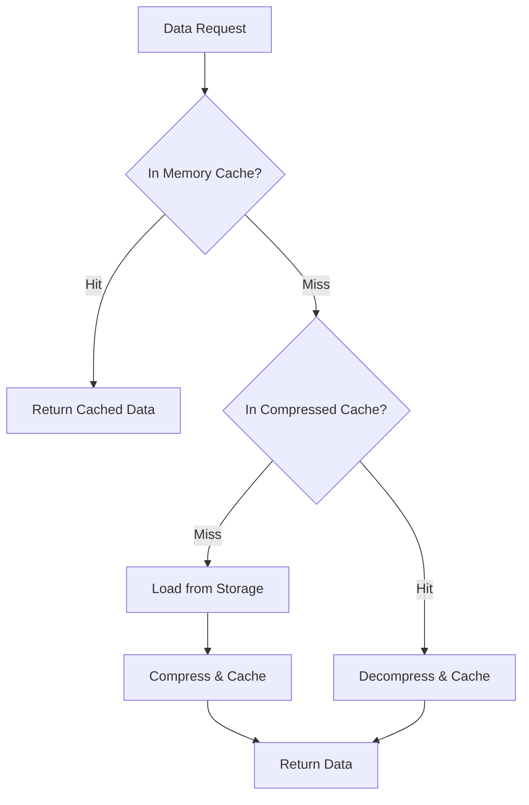

# 🏗️ UniverseJobs Plugin Architecture

## Overview

UniverseJobs is built with a modern modular architecture optimized for performance and Folia compatibility. The plugin uses a layered design with clear separation of responsibilities.

## 🎯 Design Philosophy

### 1. Modular Architecture
- **Dedicated Managers**: Each major functionality has its own manager
- **Separation of Concerns**: Each class has a single responsibility
- **Loose Coupling**: Modules communicate via well-defined interfaces
- **Extensibility**: New components can be added easily

### 2. Performance First
- **Folia Compatibility**: Native support for regionalized threading
- **Asynchronous Operations**: All I/O operations are asynchronous
- **Multi-level Cache**: Intelligent cache to optimize data access
- **Connection Pool**: Optimized database connection management

### 3. Integrated Security
- **NBT System**: Automatic protection against exploits
- **Strict Validation**: All inputs are validated
- **Exploit Detection**: Algorithms for detecting suspicious patterns

## 📋 Package Structure

```
fr.ax_dev.UniverseJobs/
├── UniverseJobs.java           # Main plugin class
├── action/                      # Action processing system
│   ├── ActionProcessor.java     # Main action processor
│   ├── ActionType.java          # Supported action types
│   └── JobAction.java           # Job action representation
├── bonus/                       # XP bonus system
│   ├── XpBonus.java             # XP bonus model
│   └── XpBonusManager.java      # Bonus manager
├── command/                     # Plugin commands
│   └── JobCommand.java          # Main /jobs command
├── compatibility/               # Compatibility with other systems
│   └── FoliaCompatibilityManager.java # Folia compatibility management
├── condition/                   # Condition system
│   ├── AbstractCondition.java   # Base condition class
│   ├── Condition.java           # Condition interface
│   ├── ConditionContext.java    # Evaluation context
│   ├── ConditionGroup.java      # Condition groups (AND/OR)
│   ├── ConditionResult.java     # Evaluation result
│   ├── ConditionType.java       # Condition types
│   └── impl/                    # Condition implementations
├── config/                      # Configuration management
│   ├── ConfigManager.java       # Main configuration manager
│   ├── LanguageManager.java     # Language management
│   └── MessageConfig.java       # Message configuration
├── job/                         # Main jobs system
│   ├── Job.java                 # Job model
│   ├── JobManager.java          # Main job manager
│   ├── PlayerJobData.java       # Player job data
│   └── XpMessageSettings.java   # XP display settings
├── listener/                    # Event listeners
│   ├── JobActionListener.java   # Main action listener
│   ├── CustomCropsEventListener.java  # CustomCrops integration
│   ├── CustomFishingEventListener.java # CustomFishing integration
│   ├── ItemsAdderEventListener.java   # ItemsAdder integration
│   └── NexoEventListener.java         # Nexo integration
├── placeholder/                 # PlaceholderAPI integration
│   ├── PlaceholderManager.java  # Main manager
│   ├── GlobalLeaderboardPlaceholder.java # Global leaderboards
│   └── JobsLeaderboardPlaceholder.java  # Job leaderboards
├── protection/                  # Anti-cheat protection system
│   └── BlockProtectionManager.java # NBT protection manager
├── reward/                      # Reward system
│   ├── Reward.java              # Reward model
│   ├── RewardManager.java       # Reward manager
│   ├── RewardStatus.java        # Reward status
│   ├── gui/                     # Reward GUI
│   └── storage/                 # Reward storage
├── storage/                     # High-performance storage system
│   ├── DataStorage.java         # Storage interface
│   ├── HighPerformanceDataStorage.java # Optimized implementation
│   ├── PerformanceManager.java  # Performance manager
│   ├── CacheManager.java        # Cache manager
│   ├── DataCompressor.java      # Data compression
│   └── pool/                    # Connection pool
├── utils/                       # Utilities
│   ├── MessageUtils.java        # Message utilities
│   └── XpMessageSender.java     # Optimized XP message sending
└── xp/                         # Experience system
    ├── XpCurve.java            # XP curve model
    ├── XpCurveManager.java     # XP curve manager
    └── ExpressionEvaluator.java # Mathematical expression evaluator
```

## 🔧 Main Components

### 1. UniverseJobs (Main Class)
**File** : `UniverseJobs.java:30`

The main plugin class that:
- **Initializes all managers** in the correct order
- **Manages the lifecycle** of the plugin (enable/disable)
- **Coordinates dependencies** between components
- **Provides access** to managers via getters
- **Handthe events** for player connection/disconnection

```java
// Manager initialization in onEnable()
this.configManager = new ConfigManager(this);
this.languageManager = new LanguageManager(this);
this.foliaManager = new FoliaCompatibilityManager(this);
this.jobManager = new JobManager(this);
this.actionProcessor = new ActionProcessor(this, jobManager, bonusManager, messageSender);
```

### 2. JobManager (Job Manager)
**File** : `JobManager.java:21`

The core of the jobs system that:
- **Loads jobs** from YAML files
- **Manages player data** (XP, levels, active jobs)
- **Calculates levels** using XP curves
- **Saves data** asynchronously
- **Integrates PerformanceManager** for large servers

**Key Features** :
```java
// Add XP with max level verification
public void addXp(Player player, String jobId, double xp)

// Level calculation with custom XP curve
public int getLevel(Player player, String jobId)

// Optimized save with compression
public void saveAllPlayerData()
```

### 3. ActionProcessor (Action Processor)
**File** : `ActionProcessor.java:23`

Processes all player actions:
- **Checks conditions** for each action
- **Applies XP multipliers** (permissions, temporary bonuses)
- **Handles level ups** with sounds and commands
- **Executes action effects** (messages, commands)
- **Integrates anti-cheat** via conditions

**Processing Flow** :
```java
Player action → Target matching → Condition evaluation → XP calculation → Level check → Effects execution
```

### 4. ConditionSystem (Condition System)
**Package** : `condition/`

Flexible condition system with:
- **AND/OR logic** to combine conditions
- **Multiple types** : permissions, time, world, items, placeholders
- **Contextual evaluation** based on event
- **Conditional actions** (messages, sounds, commands)

**Complex condition example** :
```yaml
requirements:
  logic: "AND"
  permission:
    permission: "vip.mining"
  time:
    min: 6000  # Day only
    max: 18000
  world:
    worlds: ["world", "mining_world"]
```

### 5. Storage System (Storage System)
**Package** : `storage/`

High-performance storage architecture:
- **PerformanceManager** : Coordinates operations
- **DataCompressor** : Automatic compression
- **CacheManager** : Multi-level cache with LRU
- **ConnectionPool** : Optimized connection pool
- **Batch operations** : Batch processing for MySQL

## 🔄 Data Flow

### 1. Plugin Initialization


### 2. Action Processing


### 3. Cache System


## ⚡ Performance Optimizations

### 1. Folia Compatibility
- **Regionalized threading** : Each region runs independently
- **Minimal synchronization** : Reduced locks
- **Asynchronous operations** : Non-blocking I/O

### 2. Memory Management
- **Intelligent cache** : LRU with automatic cleanup
- **Compression** : 60-80% reduction in memory usage
- **Weak references** : Memory leak prevention

### 3. Database
- **Connection pooling** : Connection reuse
- **Batch operations** : Batch processing
- **Prepared statements** : SQL injection protection + performance

## 🔒 Security

### 1. NBT Protection
- **Automatic marking** of blocks placed by players
- **Intelligent cleanup** of obsolete data
- **Optimized performance** : Minimal impact on gameplay

### 2. Input Validation
- **Strict validation** of all configurations
- **Sanitization** of user inputs
- **Command injection protection**

### 3. Exploit Detection
- **Adaptive cooldowns** to prevent spam
- **Pattern detection** for suspicious behavior
- **Detailed logging** for auditing

## 🧩 Extensibility

### 1. Events API
```java
// Events available for developers
PlayerJobJoinEvent       // Join a job
PlayerJobLeaveEvent      // Leave a job  
PlayerXpGainEvent        // XP gain (cancellable)
PlayerLevelUpEvent       // Level up
PlayerRewardClaimEvent   // Reward claim
JobActionEvent           // Job action performed
```

### 2. Plugin Integrations
- **Modular listeners** : One listener per integrated plugin
- **Automatic detection** : Conditional registration
- **Flexible configuration** : Support for new plugins via config

### 3. Custom Actions
```java
// Interface for creating custom actions
public interface CustomActionHandler {
    boolean canHandle(ActionType type, ConditionContext context);
    double processAction(Player player, Job job, ConditionContext context);
}
```

## 📊 Monitoring and Debug

### 1. Performance Metrics
```java
// Statistics available via PerformanceManager
Map<String, Object> stats = jobManager.getPerformanceStats();
// - Average processing time
// - Memory usage
// - Cache hit/miss rate
// - Operations per second
```

### 2. Intelligent Logging
- **Conditional debug** : Activation via configuration
- **Log levels** : INFO, WARNING, SEVERE
- **Enriched context** : Player UUID, job, action in logs

### 3. Health Checks
```java
// System health verification
Map<String, Object> health = jobManager.getHealthInfo();
// - DB connection status
// - Cache health
// - Thread performance
```

## 🔮 Future Architecture

### 1. Microservices Ready
- **REST API** : Data exposure via HTTP
- **Message Queue** : Inter-server communication
- **Service Discovery** : Automatic service discovery

### 2. Machine Learning
- **Auto-balancing** : Automatic XP curve adjustment
- **Pattern Detection** : Advanced exploit detection
- **Predictive Caching** : Usage-based predictive cache

### 3. Cloud Native
- **Kubernetes Support** : Container deployment
- **Auto-scaling** : Load-based automatic scaling
- **Observability** : Unified metrics, traces, logs

---

This modular and optimized architecture allows UniverseJobs to efficiently manage thousands of players while remaining extensible and maintainable.